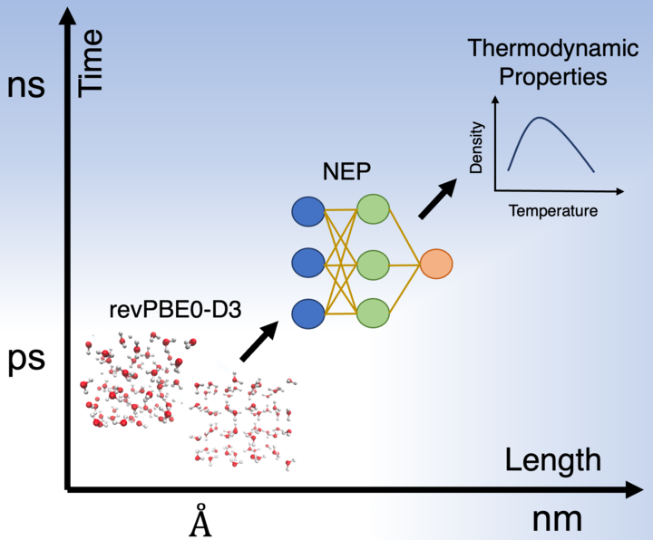

# water_ice_nep
SI of paper "Thermodynamics of Water and Ice from a Fast and Scalable First-Principles Neuroevolution Potential" .

   
This repository is structured as follow:
* nep-pre-train-model:
    * nep.txt: NEP potential for water/ice systems, as descriped in the manscript
    * nep.in: Input file used to develop the NEP potential

* nep-fitting:
  * data.xyz: Data set used for potential-fitting,  in [extended xyz format](https://wiki.fysik.dtu.dk/ase/ase/io/formatoptions.html)
  * nep.in: Input file used to develop the NEP potential
  
* notebook-examples:
   * example-1.ipynb: Fit a NEP potential and make single-point predictions with pre-train model.
   * example-2.ipynb: Perform simulations for runtime profiling, computing RDFs and vDOS.
   * example-3.ipynb: Perform simulations to compute orthobaric densities for ice ih.
   * example-4.ipynb: Perform simulations to compute isothermal compressibility.
   * example-5.ipynb: Perform simulations to compute enthalpy of melting.

* water-pimd-input-files:
   * input3.xml: Parameter file for the PIMD run.
   * run.in: LAMMPS-PIMD input file.
   * compile_lammps_nep.sh: Bash script to compile NEP potential with LAMMPS.

* D2O-simulations:  Essential input files to reproduce calcualtions shown in figure 5 to 8.

 * Disclaimers:
   * More details about the data set can be found [here](https://aip.scitation.org/doi/full/10.1063/5.0016004) and [here](https://zenodo.org/record/4004590#.YbB2H9DMJPY).
   * The colab notebook examples are compactable with [GPUMD](https://github.com/brucefan1983/GPUMD) and [TDMDpy](https://github.com/ZKC19940412/tdmdpy).
   * Parameters for simulations and potential fittings used in these examples are modified so that each example can be executed in a reasonable amount of time, please refer to the publications for all relevant parameters to reproduce the results.
